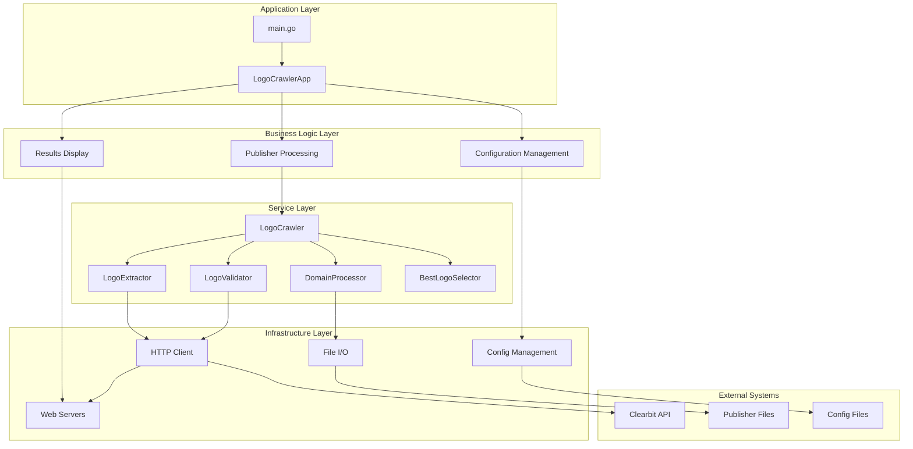
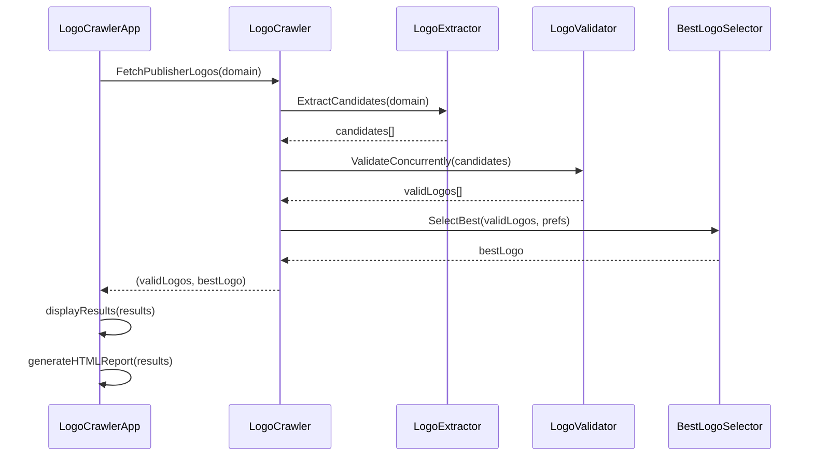

# Logo Crawler - Architecture Documentation

## System Architecture



## Component Overview

### Core Components

| Component | Responsibility | Key Methods |
|-----------|---------------|-------------|
| **LogoCrawlerApp** | Application orchestration | `Run()`, `loadEnvironment()`, `processPublishers()` |
| **LogoCrawler** | Business logic coordination | `FetchPublisherLogos()` |
| **LogoExtractor** | Logo candidate extraction | `ExtractCandidates()`, `extractFromHTML()` |
| **LogoValidator** | Concurrent logo validation | `ValidateConcurrently()`, `validateSingleLogo()` |
| **DomainProcessor** | Domain detection | `DetectDomain()` |
| **BestLogoSelector** | Logo quality assessment | `SelectBest()`, `meetsMinimumRequirements()` |
| **HTMLGenerator** | HTML report generation | `GenerateReport()`, `getHTMLTemplate()` |

## Data Flow



## Concurrency Patterns

| Pattern | Purpose | Implementation |
|---------|---------|----------------|
| **Worker Pool** | Process multiple publishers | `FetchPublishersConcurrently()` |
| **Semaphore** | Limit concurrent validations | `LogoValidator.semaphore` (10 max) |
| **Context Cancellation** | Timeout handling | 30-second validation timeout |
| **Channel Communication** | Result collection | Buffered channels |

## Configuration

### Environment Variables
- `PUBLISHER_FILE_PATH`: Path to publishers file
- `CONFIG_FILE_PATH`: Path to configuration file  
- `MAX_WORKERS`: Number of concurrent workers (optional)
- `HTML_OUTPUT_PATH`: Path for HTML report output (optional)

### YAML Configuration
```yaml
preferred:
  min_width: 120
  min_height: 120
```

## Performance

- **Speedup**: 1.66x faster than sequential processing
- **Scalability**: Worker pool scales with CPU cores
- **Resource Management**: Bounded by semaphore and worker limits
- **Error Handling**: Graceful degradation with panic recovery
